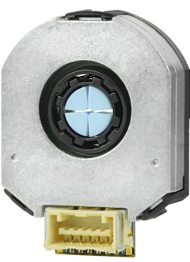

Misc
========

This is the testing page

Tests
--------------

name in between

.. container:: twocol

   .. container:: leftside

      Bla-bla-blah, and yada-yada. asdsads asd asdas dsad sad d asd asd asd asdasd
      laskdjsakldjaskldj kj dlasjd laskdj salkd jad kldjsa dlkasj lsa

   .. container:: rightside

      .. figure:: ../figures/hardware/amt213fv.PNG
         :alt: AMT21
         :scale: 45%

lets try a new one

.. container:: twocol

    .. container:: leftside

        text on left column

    .. container:: rightside

        text on right column

bob

.. hlist::
   :columns: 2

   * A list of
   * short items
   * that should be
   * displayed
   * horizontally

.. table::
   :align: center
   :widths: auto

   +-----------------------------------------------------+--------------------------+
   | .. image:: ../figures/hardware/amt213fv.PNG         |                          |
   |                                                     |                          |
   |                                                     |                          |
   |                                                     |                          |
   |                                                     |    Tool1                 |
   |                                                     |    Tool2                 |
   |                                                     |    Tool3                 |
   |                                                     |    Tool4                 |
   |                                                     |    Tool5                 |
   |                                                     |    Tool6                 |
   |                                                     |    Tool7                 |
   |                                                     |    Tool8                 |
   +-----------------------------------------------------+--------------------------+

Inline math is used with Since Pythagoras, we know that :math:`a^2 + b^2 = c^2`.

Math blocks are used with

.. math::

   (a + b)^2 = a^2 + 2ab + b^2

   (a - b)^2 = a^2 - 2ab + b^2

New math block test

.. math::

   a = \inf \int^{a}_{b} x dx

.. math::

   \frac{ \sum_{t=0}^{N}f(t,k) }{N}

Now lets try a coding block

.. code-block:: CPP

      int a = 0;
      int b = 1;
      float c = static_cast<float>(b);

Question:
If i consider the different moment if inertia compared to the center of mass and hinge joint rotation, will the sum of angular momentum then concern the same angular acceleration of the rigid body?

Yes, the sum of angular momentum will still lead to the same angular acceleration of the rigid body, even if the moments of inertia are considered with respect to different points.

The law of conservation of angular momentum states that the total angular momentum of an isolated system remains constant unless an external torque acts on it. This means that the sum of the angular momentum of all parts of the rigid body must be conserved.

When calculating the angular momentum of a rigid body, we can consider the moments of inertia with respect to any point. However, the choice of point will affect the angular velocity and the kinetic energy of the body. The point about which the moments of inertia are calculated is called the axis of rotation. If we choose a different axis of rotation, the moments of inertia and the angular velocity will change, but the angular momentum will remain the same.

Therefore, if we consider the moments of inertia with respect to the center of mass and the hinge joint rotation, the sum of angular momentum will still be conserved, and the rigid body will experience the same angular acceleration.