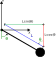

Simulation
==========

The dynamics of the system can be modeled using either Newtonian or Lagrangian mechanics,
which are two different approaches to describe the motion of physical systems. In the Newtonian approach,
the equations of motion are derived from the fundamental laws of mechanics, such as Newton's laws of motion and
the principle of conservation of energy. In the Lagrangian approach, the equations of motion are derived from the
Lagrangian, which is a function that summarizes the energy of the system in terms of generalized coordinates and
their time derivatives.

The two approaches are equivalent, meaning that they provide the same physical predictions for a given system.
The Lagrangian approach, however, often provides a more elegant and concise way of deriving the equations of motion.
In this chapter, both approaches will be applied in order to derive the equations of motion for the inverted pendulum
on a cart system. First the Newtonian approach will be applied to derive the equations of motion, and then the
Lagrangian approach to obtain the same set of equations.

After the equations of motion have been derived, the system will be simulated using numerical methods. Specifically,
the Forward Euler and Fourth order Runge-Kutta methods will be explored. Both the Euler and Runge-Kutta methods have
their advantages and disadvantages, and the choice of which method to use will depend on the specific requirements of
the simulation. In general, the Euler method is simpler and faster, but may not be accurate enough for some applications.
The Runge-Kutta method, on the other hand, is more accurate and stable, but may be slower and more computationally expensive.

By using these numerical methods to simulate the inverted pendulum on a cart system, the dynamics of the system can be explored
and different control strategies can be tested.

Pole Cart Model
***************

asdsadd hello hei

.. container:: align-center

    .. image:: ../figures/04_simulation/cart_pole.svg
        :scale: 150%

|

Newtonian Approach
------------------
|

.. container:: align-center

    .. figure:: ../figures/04_simulation/CartFBDKD.svg
        :scale: 150%

        Cart Free body diagram (FBD) and kinetic diagram (KD)

From the FBD and KD displayed of the cart in the above figure, the following equation is derived
applying Newton’s second law. Since the cart is constrained to only be able to move along
the X-axis, the horizontal forces are ignored as it will not give any useful information.
Further, the constraint applied means that the cart is not able to rotate. Specifically, :math:`\ddot{\theta}` is
zero and is constant.

.. math::
    m_c\ddot{x}_{cx} = F_m - F_f + R_x

.. math::
    F_f = b\dot{x}

|

.. container:: align-center

    .. figure:: ../figures/04_simulation/PoleFBDKD.svg
        :scale: 115%

        Pole Free body diagram (FBD) and kinetic diagram (KD)

From the FBD and KD displayed of the pole in figure above, multiple equations can be derived
by applying Newton’s second law. First the horizontal forces are considered, where the blow equation derived.

.. math::
    :label: eq:1

    m_p\ddot{x}_{px} = −R_x

It is beneficial to be able to describe the linear acceleration of the pendulum in the horizontal
direction by the carts acceleration and the pendulum rotational acceleration. This is done
by substituting the variable :math:`\ddot{x}_{px}` in the below equation. Since the pendulum is attached to the
cart with a revolute joint, the pendulums acceleration in the horizontal direction can be
described.

    Kinematics assist figure

Utilizing the above figure, the kinematic relations to the pole are derived

Position

.. math::
    \begin{bmatrix}
        x_p \\
        y_p
    \end{bmatrix}
    = r_p = L
    \begin{bmatrix}
        \sin(\theta) \\
        -\cos(\theta)
    \end{bmatrix}

Velocity

.. math::
    \begin{bmatrix}
        \dot{x}_p \\
        \dot{y}_p
    \end{bmatrix}
    = \dot{r}_p = L\dot{\theta}
    \begin{bmatrix}
        \cos(\theta) \\
        \sin(\theta)
    \end{bmatrix}

Acceleration

.. math::
    \begin{bmatrix}
        \ddot{x}_p \\
        \ddot{y}_p
    \end{bmatrix}
    = \ddot{r}_p = L\ddot{\theta}
    \begin{bmatrix}
        \cos(\theta) \\
        \sin(\theta)
    \end{bmatrix}
    + L\dot{\theta}^2
    \begin{bmatrix}
        -\sin(\theta) \\
        \cos(\theta)
    \end{bmatrix}

Finally the pendulums acceleration along the X-axis can be described in relation to the moving cart

.. math::
    :label: eq:2

    \ddot{x}_{px} = \ddot{x}_{cx} + \ddot{r}_{px} = \ddot{x}_{cx} +  L\ddot{\theta} \cos (\theta) - L\dot{\theta}^2 \sin (\theta)

Substituting :eq:`eq:2` into :eq:`eq:1` Yields

.. math::

    m_p\ddot{x}_{cx} + m_pL\ddot{\theta}\cos(\theta) - m_pL\dot{\theta}^2\sin(\theta) = −R_x

Then by substituting the above equation with, the variable :math:`R_x` is eliminated.

.. math::

    m_c\ddot{x}_{cx} = F_m - F_f - m_p\ddot{x}_{cx} - m_pL\ddot{\theta}\cos(\theta) + m_pL\dot{\theta}^2\sin(\theta)

The equation is then simplified into :eq:`eq:3`

.. math::
    :label: eq:3

    (m_c + m_p)\ddot{x}_{cx} + m_pL\ddot{\theta}\cos(\theta) - m_pL\dot{\theta}^2\sin(\theta) = F_m - F_f

Then, the vertical forces acting on the pole is considered.

.. math::
    :label: eq:4

    m_p \ddot{x}_{py} = -R_y - m_pg

Same as for the horizontal components, it is beneficial to substitute  :math:`\ddot{x}_{py}` with the states the
carts linear acceleration and the pendulums angular acceleration. Since the cart is not able
to move in the horizontal direction :math:`\ddot{x}_{cy}` is zero.

.. math::
    :label: eq:5

        \ddot{x}_{py} = \ddot{x}_{cy} + \ddot{r}_{py} = 0 + L\ddot{\theta} \sin(\theta) + L\dot{\theta}^2\cos(\theta)

Substituting :eq:`eq:5` into :eq:`eq:4` yields

.. math::
    :label: eq:6

        m_pL\ddot{\theta} \sin(\theta) + m_pL\dot{\theta}^2\cos(\theta) = -R_y - m_pg

Now, the final steps are to eliminate the reaction force :math:`R_y` from the above equation. To achieve this, the sum
of moment of the pole is collected about the center of mass.

.. math::

        I_p \ddot{\theta} =  R_xL\cos(\theta) + R_yL\sin(\theta)

Solving for :math:`R_y` yields

.. math::
        :label: eq:7

        R_y = -R_x\frac{\cos(\theta)}{\sin(\theta)} + \frac{1}{L \sin(\theta)}I_p \ddot{\theta}

Substituting :eq:`eq:7` into :eq:`eq:6`

.. math::
    :label: eq:8

    m_pL\ddot{\theta} \sin(\theta) + m_pL\dot{\theta}^2\cos(\theta) = R_x\frac{\cos(\theta)}{\sin(\theta)} - \frac{1}{L_p \sin(\theta)}I_p \ddot{\theta} - m_pg

Substituting :math:`R_x` into :eq:`eq:8`

.. math::

    m_pL\ddot{\theta} \sin(\theta) + m_pL\dot{\theta}^2\cos(\theta) =

.. math::

    [-m_p\ddot{x}_{cx} - m_pL\ddot{\theta}\cos(\theta) + m_pL\dot{\theta}^2\sin(\theta)]\frac{\cos(\theta)}{\sin(\theta)} - \frac{1}{L_p \sin(\theta)}I_p \ddot{\theta} - m_pg

Expanding the expression

.. math::

    m_pL\ddot{\theta} \sin(\theta) + m_pL\dot{\theta}^2\cos(\theta) =

.. math::

    -m_p\ddot{x}_{cx}\frac{\cos(\theta)}{\sin(\theta)} - m_pL\ddot{\theta}\cos(\theta)\frac{\cos(\theta)}{\sin(\theta)} + m_pL\dot{\theta}^2\sin(\theta)\frac{\cos(\theta)}{\sin(\theta)} - \frac{1}{L \sin(\theta)}I_p \ddot{\theta} - m_pg

Simplifying

.. math::

    m_pL\ddot{\theta} \sin(\theta) + m_pL\dot{\theta}^2\cos(\theta) =

.. math::

    -m_p\ddot{x}_{cx}\frac{\cos(\theta)}{\sin(\theta)} - m_pL\ddot{\theta}\frac{\cos(\theta)^2}{\sin(\theta)} + m_pL\dot{\theta}^2\cos(\theta) - \frac{1}{L \sin(\theta)}I_p \ddot{\theta} - m_pg

The expression is then expanded with :math:`\sin(\theta)`

.. math::

    m_pL\ddot{\theta} \sin(\theta)^2 + m_pL\dot{\theta}^2\cos(\theta)\sin(\theta) =

.. math::

    -m_p\ddot{x}_{cx}\cos(\theta) - m_pL\ddot{\theta}\cos(\theta)^2 + m_pL\dot{\theta}^2\cos(\theta)\sin(\theta) - \frac{1}{L }I_p \ddot{\theta} - m_pg\sin(\theta)

The expression is then simplified further

.. math::

    m_pL^2\ddot{\theta}  = -m_pL\ddot{x}_{cx}\cos(\theta) - I_p \ddot{\theta} - M_pLg\sin(\theta)

From the above calculations the equations of motions are derived to be

.. math::

    \ddot{x}_{cx} = \frac{F_m - F_f - m_pL\ddot{\theta}\cos(\theta) + m_pL\dot{\theta}^2\sin(\theta)}{m_p + m_c}

.. math::

    \ddot{\theta}  = \frac{-m_pL\ddot{x}_{cx}\cos(\theta) - M_pLg\sin(\theta)}{I_p + m_pL^2}

Lagrangian Approach
-------------------

asdasdasdsad

Forward Euler
*************

The forward Euler can be considered the The simplest method for numerical integration. It involves using the current
state of the system to estimate its next state. The Euler method can be prone to numerical instability and may
require a very small time step to accurately simulate the system.

Runge-Kutta
***********

The fourth-order Runge-Kutta method is a numerical integration scheme commonly used to solve ordinary differential equations.
It is a higher-order method than the forward Euler method, meaning that it is more accurate and can use a larger time
step while maintaining stability.

The method works by evaluating the state of the system at multiple intermediate time steps, using a weighted average of
these evaluations to determine the next state of the system. The weights used in the averaging process are chosen to
minimize the error in the approximation, resulting in a more accurate simulation.

Although the fourth-order Runge-Kutta method is more computationally expensive than the forward Euler method, it is a
popular choice for simulating physical systems due to its accuracy and stability. It is also a versatile method that can
be adapted to different types of differential equations, making it a valuable tool for many applications in science and engineering.
